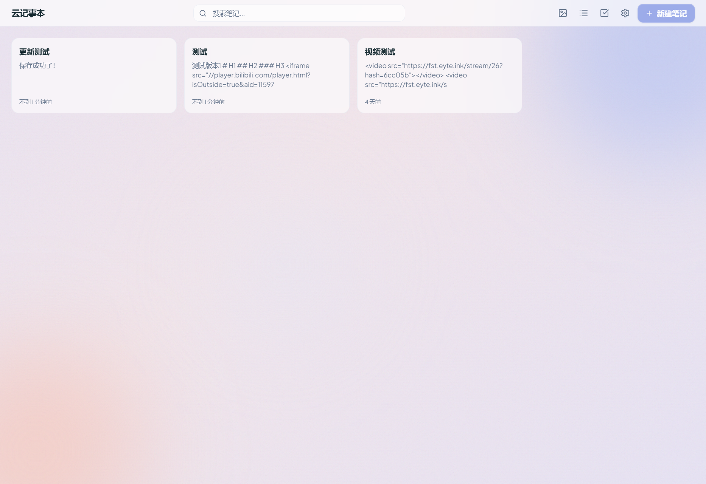
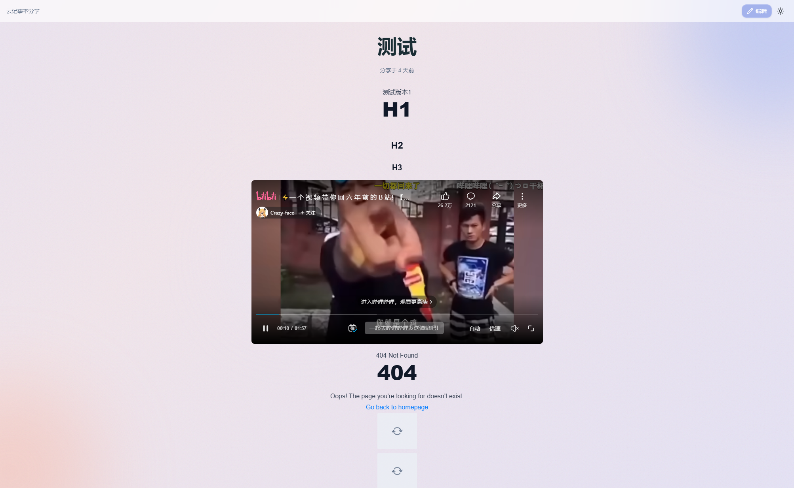

<div align="center">

# InkPad

**自托管 Markdown 云笔记，支持实时同步、多平台部署与无密码登录。**

[](./LICENSE)
[](https://ghcr.io/eyte112/inkpad)

[](https://edgeone.ai/pages/new?repository-url=https%3A%2F%2Fgithub.com%2Feyte112%2Finkpad)
[](https://deploy.workers.cloudflare.com/?url=https://github.com/eyte112/inkpad)

[功能特性](#功能特性) · [预览截图](#预览截图) · [快速开始](#快速开始) · [部署方式](#部署方式) · [本地开发](#本地开发)

<a href="./README.en.md">English</a>

</div>

---

## 功能特性

| | 特性 | 说明 |
|---|------|------|
| :pencil2: | **Markdown 编辑器** | 实时预览，基于 [@uiw/react-md-editor](https://github.com/uiwjs/react-md-editor) |
| :floppy_disk: | **自动保存** | 2 秒防抖 + 乐观锁版本控制 + 冲突检测与合并 |
| :framed_picture: | **多图床上传** | 支持 GitHub / S.EE / Imgur / R2，后端统一代理 |
| :link: | **笔记分享** | 短链接 + 可选密码保护 |
| :key: | **无密码登录** | WebAuthn Passkey（纯 Web Crypto，无服务端依赖） |
| :crescent_moon: | **深色模式** | 跟随系统 + 手动切换 |
| :label: | **标签与搜索** | 快速组织和查找笔记 |
| :clock3: | **历史版本** | 自动记录每次保存，随时查看和回滚到任意历史版本 |
| :bulb: | **修改建议** | 分享页访客可提交修改建议，作者审核后一键采纳 |
| :globe_with_meridians: | **多平台部署** | 统一 KV 抽象接口，一套代码多处运行 |

### 开发计划

- 分享链接后缀自定义（自定义短链 slug）
- 分享过期时间设置
- 笔记导出（PDF / HTML / Markdown 打包下载）
- 阅后即焚（分享内容查看后自动销毁）
- 端到端加密（客户端加密，服务端零知识）

## 预览截图

<p align="center">
  
</p>
<p align="center">
  
</p>
<p align="center">
  
</p>
<p align="center">
  
</p>

## 技术栈

| 层级 | 技术 |
|:-----|:-----|
| **前端** | React 19 · TypeScript · Vite 7 · Tailwind CSS 4 |
| **状态管理** | Zustand 5 · TanStack Query 5 |
| **UI 组件** | Radix UI · Lucide React |
| **后端** | 平台无关的 TypeScript Handler |
| **数据存储** | 统一 KV 接口（`IKVStore`） |
| **VPS 运行时** | Hono · better-sqlite3 |

## 快速开始

### Docker（推荐）

```bash
docker run -d \
  --name inkpad \
  -p 3000:3000 \
  -v inkpad-data:/app/data \
  ghcr.io/eyte112/inkpad:latest
```

打开 `http://localhost:3000`，首次访问设置密码即可使用。

### Docker Compose

```yaml
services:
  inkpad:
    image: ghcr.io/eyte112/inkpad:latest
    ports:
      - "3000:3000"
    volumes:
      - inkpad-data:/app/data
    restart: unless-stopped

volumes:
  inkpad-data:
```

## 部署方式

### 方式一：VPS / Docker

数据持久化在 SQLite，默认路径 `/app/data/inkpad.db`。

| 环境变量 | 说明 | 默认值 |
|:---------|:-----|:-------|
| `PORT` | 服务端口 | `3000` |
| `DB_PATH` | SQLite 数据库路径 | `./data/inkpad.db` |
| `CORS_ORIGINS` | 允许的跨域来源（逗号分隔） | 仅同源 |

### 方式二：EdgeOne Pages

1. 推送代码到 GitHub
2. 在 [EdgeOne Pages 控制台](https://console.cloud.tencent.com/edgeone/pages) 导入项目
3. 构建命令 `npm run build`，输出目录 `dist`
4. 创建 KV 命名空间并绑定到 Functions

### 方式三：Cloudflare Workers

1. 安装 Wrangler CLI：`npm i -g wrangler`
2. 创建 KV 命名空间：`wrangler kv namespace create KV`
3. 将返回的 `id` 填入 `wrangler.toml` 的 `kv_namespaces` 配置
4. 部署：`wrangler deploy`

## 项目结构

```
src/           -> 前端 React SPA
functions/     -> 后端业务逻辑（平台无关）
  ├── api/     -> REST API 路由
  └── shared/  -> 认证、KV 抽象、统一路由器
server/        -> VPS 入口（Hono + SQLite）
platforms/     -> 其他平台入口
  └── cloudflare/  -> Cloudflare Workers 入口
```

> **KV 抽象层** — 业务逻辑通过 `IKVStore` 统一接口访问数据。各平台适配器（EdgeOne KV、SQLite、Cloudflare Workers 等）实现该接口。新增平台只需实现接口 + 创建入口文件。

## 本地开发

```bash
git clone https://github.com/eyte112/inkpad.git
cd inkpad
npm install

# VPS 模式（前后端一体，本地 SQLite）
npm run dev:server

# 仅前端（需要已部署的后端）
npm run dev
```

<details>
<summary><b>全部命令</b></summary>

```bash
npm run build          # 前端生产构建
npm run build:server   # 后端生产构建
npm run start:server   # 生产环境启动
npm run lint           # ESLint 检查
npm run format         # Prettier 格式化
```

</details>

## 参与贡献

1. Fork 本仓库
2. 创建特性分支 (`git checkout -b feat/amazing-feature`)
3. 提交更改 (`git commit -m 'feat: add amazing feature'`)
4. 推送分支 (`git push origin feat/amazing-feature`)
5. 发起 Pull Request

## 许可证

[AGPL-3.0](./LICENSE)
